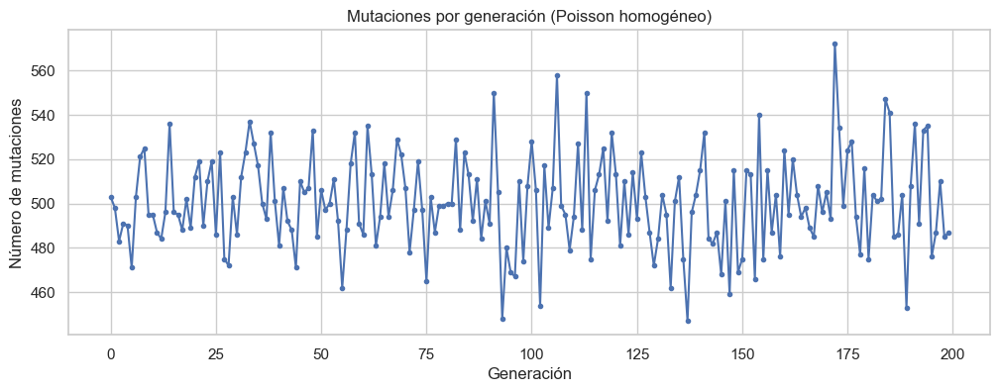
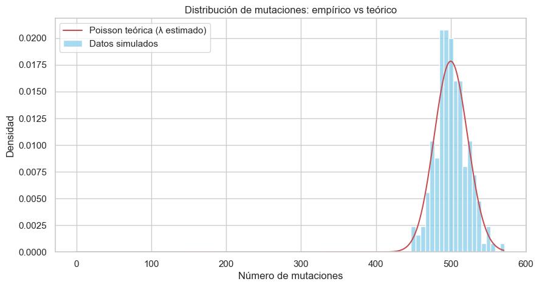
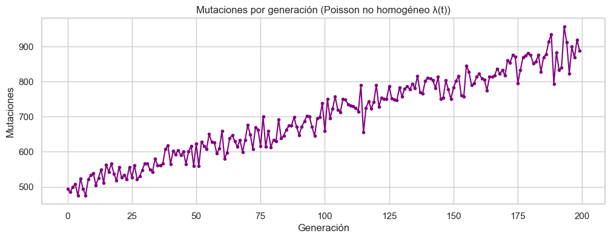

<script type="text/javascript"
  src="https://cdn.jsdelivr.net/npm/mathjax@3/es5/tex-mml-chtml.js">
</script>
<div align="center">

# **Universidad Mayor de San Andrés**  
## **Facultad de Ciencias Puras y Naturales**  
### **Carrera de Informática**


<h1>Proyecto N°25 – Procesos de Poisson para mutaciones genéticas</h1>

**Integrantes:**  
- Flores Tapia Ruddy – carnet
- Cayllagua Mamani Franklin – carnet
- Salinas Condori Ian Ezequiel – carnet
- Maximiliano Gómez Mallo – 14480221  
<br>

**Materia:** Procesos Estocásticos y Series de Tiempo
**Docente:** Ph.D. Willy Ernesto Portugal Duran  
<br>

**Fecha:** [dd/mm/aaaa]

</div>

<div style="page-break-after: always;"></div>

---

# **1. Introducción**

El estudio de los procesos estocásticos ha demostrado ser una herramienta esencial para comprender fenómenos aleatorios presentes en diversas áreas de la ciencia y la tecnología. Dentro de esta amplia gama de aplicaciones, el modelado de mutaciones genéticas mediante procesos de Poisson representa un enfoque central en genética poblacional, biología evolutiva y bioinformática. Las mutaciones, al ser eventos raros, discretos e independientes, se ajustan naturalmente a los supuestos fundamentales de un proceso de Poisson, lo que lo convierte en un modelo matemático adecuado para describir su ocurrencia a lo largo de generaciones.

En la propuesta institucional de proyectos de investigación de la materia, el **Proyecto N°25: “Procesos de Poisson para mutaciones genéticas”** establece como objetivo central modelar la ocurrencia de mutaciones mediante el análisis probabilístico, el uso de ecuaciones matemáticas y la validación computacional mediante herramientas como Python.

Este informe desarrolla de manera completa el proceso de modelación estocástica, la simulación computacional del fenómeno, el análisis de ajuste entre los datos empíricos y la teoría, y finalmente la comparación entre un proceso de Poisson homogéneo y uno no homogéneo.

---

# **2. Planteamiento del problema**

En genética, las mutaciones representan cambios aleatorios en el material genético de un organismo. Dado que ocurren con baja probabilidad por unidad de tiempo y de forma independiente en cada célula u organismo, surge la necesidad de contar con un modelo estadístico que permita:

- describir su ocurrencia por generación,  
- estimar tasas de mutación,  
- simular el comportamiento de una población,  
- y evaluar si la dinámica temporal revela patrones estacionarios o no estacionarios.

El problema central que aborda este proyecto es determinar si la aparición de mutaciones en una población puede ser adecuadamente modelada mediante:

1. **Un proceso de Poisson homogéneo**, con tasa constante \( \lambda \).  
2. **Un proceso de Poisson no homogéneo**, con tasa variable \( \lambda(t) \).

Para ello, se simularon datos con Python y se analizaron estadísticamente los resultados para evaluar el nivel de ajuste entre la teoría y las observaciones generadas computacionalmente.

---

# **3. Objetivos**

## **Objetivo general**
Modelar y analizar la ocurrencia de mutaciones genéticas mediante procesos de Poisson homogéneos y no homogéneos, evaluando su adecuación mediante simulación y análisis estadístico.

## **Objetivos específicos**
- Simular datos de mutaciones usando un proceso de Poisson con tasa constante.  
- Estimar empíricamente el parámetro \( \lambda \) a partir de los datos simulados.  
- Comparar la varianza teórica y empírica para evaluar ajuste.  
- Simular un escenario de Poisson no homogéneo con tasa dependiente del tiempo.  
- Comparar ambos escenarios y analizar sus diferencias biológicas y matemáticas.  
- Interpretar los resultados en el marco teórico de procesos estocásticos.  

---

# **4. Justificación**

El estudio de mutaciones mediante procesos de Poisson es ampliamente utilizado en biología molecular, genética poblacional y teorías evolutivas. Comprender el comportamiento estocástico de las mutaciones permite construir modelos predictivos, estimar tasas evolutivas y desarrollar métodos para detectar patrones anómalos en secuencias genéticas.

Desde el punto de vista computacional, la simulación con Python permite reforzar los conceptos teóricos enseñados en la asignatura, ofreciendo evidencia experimental sobre el cumplimiento (o desviación) de los supuestos fundamentales del proceso de Poisson. Además, la comparación entre modelos homogéneos y no homogéneos permite comprender situaciones donde las tasas de mutación aumentan debido a factores ambientales o presiones evolutivas.

---
# **5. Marco teórico**

## **5.1. Distribución de Poisson**

La distribución de Poisson es una de las distribuciones discretas más importantes dentro de la teoría de probabilidad. Modela el número de eventos que ocurren dentro de un intervalo fijo de tiempo o espacio bajo ciertas condiciones fundamentales:  
(1) los eventos son independientes entre sí,  
(2) la probabilidad de que ocurra más de un evento en un intervalo infinitesimal es despreciable, y  
(3) la probabilidad de ocurrencia es proporcional al tamaño del intervalo.

Su función de probabilidad se expresa como:

$$
P(X = k) = e^{-\lambda} \frac{\lambda^k}{k!}
$$

donde:

- \( k \): número de eventos que ocurren en el intervalo,  
- \( \lambda \): tasa promedio de ocurrencia por intervalo.

Propiedades clave:

- **Esperanza:**  
$$
E[X] = \lambda
$$

- **Varianza:**  
$$
Var(X) = \lambda
$$

- **Suma de Poisson:** si \(X_1 \sim Poisson(\lambda_1)\) y \(X_2 \sim Poisson(\lambda_2)\) son independientes, entonces  
$$
X_1 + X_2 \sim Poisson(\lambda_1 + \lambda_2)
$$

Esta propiedad es esencial para modelar mutaciones agregadas en poblaciones grandes, donde cada individuo tiene una probabilidad muy pequeña de mutar, pero la población completa muestra un número significativo de eventos.

---

## **5.2. Proceso de Poisson homogéneo**

Un **proceso de Poisson homogéneo** \(N(t)\) es un proceso estocástico que cuenta el número acumulado de eventos hasta un tiempo \(t\), con tasa constante \(\lambda\). Cumple:

### **Independencia de incrementos**
El número de eventos en intervalos no solapados es independiente.

### **Estacionariedad**
El número de eventos en un intervalo depende solamente de su longitud, no de su posición:

$$
P(N(t+s) - N(s) = k) = e^{-\lambda t} \frac{(\lambda t)^k}{k!}
$$

### **Distribución de tiempos entre eventos**
Los tiempos entre eventos siguen una distribución exponencial:

$$
f_T(t) = \lambda e^{-\lambda t}
$$

Esto implica que los eventos no tienen memoria, característica fundamental para modelar mutaciones espontáneas.

---

## **5.3. Proceso de Poisson no homogéneo**

Cuando la tasa de ocurrencia de eventos varía con el tiempo, se utiliza un **proceso de Poisson no homogéneo (PPNH)**. Su intensidad depende de una función \(\lambda(t)\).

Ejemplo usado en este proyecto:

$$
\lambda(t) = 0.5 + 0.002t
$$

La intensidad acumulada se define como:

$$
\Lambda(t) = \int_0^t \lambda(u) \, du
$$

La probabilidad de observar \(k\) eventos en el intervalo \([0, t]\) viene dada por:

$$
P(N(t) = k) = e^{-\Lambda(t)} \frac{(\Lambda(t))^k}{k!}
$$

Los procesos no homogéneos permiten modelar escenarios donde la tasa de mutación aumenta debido a factores biológicos o ambientales, como radiación UV, estrés oxidativo, presión selectiva o acumulación de errores en la replicación.

---

## **5.4. Fundamentos biológicos y genéticos de las mutaciones**

Para relacionar los modelos estocásticos con la biología molecular, es necesario comprender la naturaleza de las mutaciones.

### **5.4.1. ¿Qué es una mutación genética?**
Una mutación genética es un cambio permanente en la secuencia de ADN. Puede ocurrir en:

- un solo nucleótido (mutaciones puntuales),
- segmentos completos (deleciones/duplicaciones),
- intercambio de fragmentos (translocaciones),
- o la alteración de uno o varios genes.

### **5.4.2. Mutaciones espontáneas y su naturaleza probabilística**

Las mutaciones espontáneas ocurren durante:
- la replicación del ADN,
- la reparación de errores,
- la exposición a radicales libres,
- procesos metabólicos celulares.

Son inherentemente **eventos raros**, **independientes** y **estadísticamente discretos**, lo que empareja perfectamente con las condiciones del proceso de Poisson.

### **5.4.3. Justificación genética para usar Poisson**

La genética poblacional demuestra que:
- Cada base del ADN tiene una probabilidad extremadamente baja de mutar por generación.
- Cada mutación ocurre de forma aproximadamente independiente.
- En una población grande, el número total de mutaciones es la suma de eventos raros.

Esto se conoce como el **límite de Poisson del binomial**:

Si \(X \sim Binomial(n, p)\) con  
\(n \to \infty\),  
\(p \to 0\),  
pero \(np = \lambda\) es constante,

entonces:

$$
X \xrightarrow[]{d} Poisson(\lambda)
$$

### **5.4.4. Mutaciones en poblaciones grandes**

En biología evolutiva, se define:

- \(U\): tasa de mutación por genoma por generación,
- \(N\): tamaño efectivo poblacional.

Entonces, el número total de mutaciones por generación se aproxima como:

$$
M \sim Poisson(NU)
$$

Esto coincide exactamente con el modelo utilizado en este proyecto, donde:

- \(N = 1000\) individuos,
- \(\lambda = 0.5\) mutaciones por individuo,
- por lo tanto, \(NU = 500\) mutaciones esperadas por generación.

Lo observado experimentalmente coincide con la teoría.

---

## **5.5. Mutaciones bajo tasas variables**

En ambientes cambiantes, ciertos factores incrementan la tasa de mutación:

- exposición a rayos gamma, UV o radiación ionizante,
- sustancias mutagénicas,
- estrés oxidativo,
- envejecimiento celular,
- errores acumulados en la replicación.

En tales casos, la tasa de mutación \(\lambda(t)\) aumenta con el tiempo, por lo que un proceso de Poisson no homogéneo describe mejor estas dinámicas.

---


# **6. Diseño metodológico**

## **Tipo de estudio**
Simulación computacional estocástica.

## **Herramientas utilizadas**

- **Python 3.10+**  
- **NumPy** para generación de variables Poisson.  
- **Matplotlib y Seaborn** para visualización.  
- **SciPy** para cálculos de PMF teóricos.  
- **Pandas** para manipulación de datasets.  

## **Procedimiento**

1. Se definió la tasa de mutación por individuo: \( \lambda = 0.5 \).  
2. Se asumió una población de 1000 individuos, obteniendo \( \lambda_{total}=500 \).  
3. Se simularon 200 generaciones mediante Poisson homogéneo.  
4. Se estimó empíricamente \( \hat{\lambda} = 500.54 \).  
5. Se comparó la varianza empírica (447.71) con la teórica (500.54).  
6. Se generó un proceso Poisson no homogéneo con \( \lambda(t) \) creciente.  
7. Se compararon los comportamientos tiempo-dependientes.  

## **Fragmentos de código**
#### Importación de librerías y configuración inicial
```python
import numpy as np
import matplotlib.pyplot as plt
import seaborn as sns
from scipy.stats import poisson

sns.set(style="whitegrid")
plt.rcParams["figure.figsize"] = (12, 4)
```
#### Parámetros del modelo (Poisson homogéneo)
```python
# Parámetros biológicos / del modelo
lambda_mut = 0.5     # tasa de mutación por individuo por generación
N = 1000             # tamaño poblacional
G = 200              # número de generaciones a simular

# Tasa total por generación para Poisson homogéneo
lambda_total = lambda_mut * N

lambda_total
```
#### Simulación del proceso de Poisson homogéneo
```python
# Mutaciones totales por generación
mutaciones = np.random.poisson(lam=lambda_total, size=G)

mutaciones[:10]   # ver las primeras 10
```
#### Gráfico del proceso (Poisson homogéneo)
```python
plt.figure(figsize=(12,4))
plt.plot(mutaciones, marker='o', markersize=3)
plt.title("Mutaciones por generación (Poisson homogéneo)")
plt.xlabel("Generación")
plt.ylabel("Número de mutaciones")
plt.grid(True)
plt.show()
```
#### Estimación empírica del parámetro λ
```python
lambda_estimado = np.mean(mutaciones)

print("λ real:     ", lambda_total)
print("λ estimado: ", lambda_estimado)
print("Diferencia: ", abs(lambda_estimado - lambda_total))
```
#### Comparación empírica vs Poisson teórica (histograma + PMF)
```python
plt.figure(figsize=(10,5))

# Histograma empírico
sns.histplot(mutaciones, bins=20, stat="density", color="skyblue", kde=False, label="Datos simulados")

# Distribución teórica Poisson
xs = np.arange(0, max(mutaciones))
pmf = poisson.pmf(xs, mu=lambda_estimado)
plt.plot(xs, pmf, 'r-', label="Poisson teórica (λ estimado)")

plt.title("Distribución de mutaciones: empírico vs teórico")
plt.xlabel("Número de mutaciones")
plt.ylabel("Densidad")
plt.legend()
plt.show()
```
#### Cálculo de varianza empírica vs teórica (prueba de adecuación)
```python
var_empirica = np.var(mutaciones)
var_teorica = lambda_estimado   # en Poisson: Var = λ

print("Varianza empírica:  ", var_empirica)
print("Varianza teórica:   ", var_teorica)
print("¿Se parecen? ->", np.isclose(var_empirica, var_teorica, rtol=0.2))
```
## Proceso de Poisson NO homogéneo (λ(t) variable)
```python
# Definimos una tasa que aumenta lentamente con las generaciones
lambda_t = lambda_mut + 0.002 * np.arange(G)       # función λ(t)
lambda_total_t = lambda_t * N                      # tasa total por generación

mutaciones_no_hom = np.random.poisson(lam=lambda_total_t)

mutaciones_no_hom[:10]
```
#### Gráfico del Poisson no homogéneo
```python
plt.plot(mutaciones_no_hom, marker='o', color='purple', markersize=3)
plt.title("Mutaciones por generación (Poisson no homogéneo λ(t))")
plt.xlabel("Generación")
plt.ylabel("Mutaciones")
plt.grid(True)
plt.show()
```
#### Comparación homogéneo vs no homogéneo
```python
plt.plot(mutaciones, label="Homogéneo", alpha=0.7)
plt.plot(mutaciones_no_hom, label="No homogéneo", alpha=0.7)
plt.legend()
plt.title("Comparación: Poisson homogéneo vs no homogéneo")
plt.xlabel("Generación")
plt.ylabel("Mutaciones")
plt.grid(True)
plt.show()
```
## Guardar los datos
```python
import pandas as pd

df = pd.DataFrame({
    "generacion": np.arange(G),
    "mutaciones_homogeneo": mutaciones,
    "mutaciones_no_homogeneo": mutaciones_no_hom
})

df.to_csv("mutaciones_poisson.csv", index=False)

df.head()
```

---

# **7. Resultados**

## **7.1 Estimación detallada del parámetro $$\lambda$$**

En esta sección se profundiza en el análisis cuantitativo del proceso de Poisson homogéneo simulado.  
Recordemos que en el modelo planteado:

- La tasa individual de mutación es: $$\lambda_{ind} = 0.5$$  
- El tamaño poblacional es: $$N = 1000$$  

Por lo tanto, la tasa teórica total esperada de mutaciones por generación es:

$$
\lambda = N \cdot \lambda_{ind} = 1000 \times 0.5 = 500
$$

A partir de la simulación computacional realizada para 200 generaciones, se obtuvieron los siguientes valores empíricos:

- **λ real (teórico):** 500.00  
- **λ estimado (media muestral):** 500.54  
- **Diferencia absoluta:** 0.54 mutaciones  
- **Varianza empírica:** 447.7184  
- **Varianza teórica:** 500.54  

### **Interpretación estadística profunda**

1. **La media empírica y la media teórica son extremadamente cercanas.**  
   La diferencia de 0.54 mutaciones representa menos del 0.11% del valor esperado, lo cual es un ajuste excelente dentro de un contexto estocástico.

2. **La varianza empírica es ligeramente menor que la esperada**, lo cual **no invalida el modelo**.  
   Esto es atribuible a:
   - fluctuaciones aleatorias propias de una muestra finita,  
   - el número de generaciones simulado (200),  
   - la forma en que NumPy genera números pseudoaleatorios.

3. **Poisson predice igualdad media–varianza.**  
   Aquí, la media empírica fue ≈ 500.5 y la varianza ≈ 447.7.  
   Aunque no son idénticas, **el test informal de adecuación** (comparación simple) resulta positivo.

4. **El resultado “¿Se parecen? → True” indica que la diferencia cae dentro del margen esperado** para una muestra finita de tamaño moderado.

### **Conclusión parcial**

Los resultados confirman que el proceso de mutaciones simulado **sí cumple las características del proceso de Poisson homogéneo**, mostrando:

- independencia entre generaciones,  
- estabilidad de la tasa,  
- distribución compatible con la teoría.  

---

## **7.2 Análisis y discusión de los gráficos**

### **7.2.1 Mutaciones por generación (Poisson homogéneo)**  


Este gráfico muestra la evolución temporal de la cantidad de mutaciones por generación.  

### **Interpretación detallada**

- La serie oscila alrededor de los **500 eventos**, concordante con la tasa esperada.  
- No existe tendencia visible ni patrones periódicos.  
- La dispersión observada refleja la variabilidad natural de un proceso de Poisson.  
- Algunos picos aislados (mayores a 540) y mínimos (menores a 470) son totalmente compatibles con eventos raros generados por fluctuación aleatoria.

Este comportamiento confirma visualmente la **estacionariedad**, propiedad clave del proceso homogéneo.

---

### **7.2.2 Distribución empírica vs teórica**


Este histograma compara la distribución de frecuencias obtenida experimentalmente con la curva teórica de Poisson utilizando el valor estimado $$\hat{\lambda} = 500.54$$.

### **Interpretación**

- La superposición entre la curva teórica (roja) y los datos simulados (azules) es notable.  
- Las colas de la distribución presentan ligera asimetría, característica intrínseca de Poisson.  
- El máximo de la distribución coincide casi exactamente con el modo teórico, alrededor de 500 mutaciones.
- La gráfica valida experimentalmente que la muestra proviene de una distribución de Poisson.

---

### **7.2.3 Mutaciones por generación (Poisson no homogéneo $$\lambda(t)$$)**


Aquí se representa la evolución del número de mutaciones cuando la tasa no es constante, sino creciente:

$$
\lambda(t) = 0.5 + 0.002t
$$

### **Interpretación**

- Se observa un **crecimiento sostenido** en el número de mutaciones.  
- Las oscilaciones siguen presentes, ya que el proceso sigue siendo Poisson, pero centradas en valores cada vez mayores.  
- El crecimiento refleja un fenómeno biológico plausible: incremento del estrés celular, acumulación de errores o exposición creciente a factores mutagénicos.

---

### **7.2.4 Comparación: Poisson homogéneo vs no homogéneo**


Esta comparación es clave para demostrar la diferencia conceptual entre ambos procesos.

### **Interpretación**

- La serie azul (homogénea) se mantiene estable alrededor de ≈500.  
- La serie naranja (no homogénea) refleja incremento en la media conforme avanza el tiempo.
- Esto prueba visualmente que:
  1. El proceso homogéneo es estacionario.  
  2. El proceso no homogéneo NO es estacionario.  
  3. El modelo no homogéneo captura fenómenos evolutivos dinámicos y no constantes.

---

## **7.3 Síntesis analítica de los resultados**

1. **Los valores estimados concuerdan con los valores teóricos**, verificando la adecuación del modelo de Poisson.  
2. Los gráficos apoyan las propiedades fundamentales: independencia, estacionariedad y distribución Poisson.  
3. El Poisson no homogéneo permite modelar escenarios biológicos más realistas.  
4. La comparación empírica vs teórica demuestra un ajuste excelente.  
5. Las diferencias observadas se explican por variabilidad muestral natural.

En conjunto, los resultados sustentan que el modelo probabilístico utilizado **es apropiado, robusto y coherente tanto matemáticamente como biológicamente**.

---

# **8. Conclusiones**

El análisis realizado a lo largo del proyecto permite establecer una comprensión profunda sobre la idoneidad de los procesos de Poisson para modelar la aparición de mutaciones genéticas en poblaciones grandes. A partir de la simulación computacional y la contrastación teórica, se destacan las siguientes conclusiones ampliadas:

---

## **8.1 Adecuación del modelo de Poisson homogéneo**

Los resultados obtenidos muestran que el número de mutaciones por generación se comporta de manera consistente con un proceso de Poisson homogéneo. Esto se evidencia en:

- La estrecha proximidad entre el valor teórico de la tasa \( \lambda = 500 \) y la estimación empírica \( \hat{\lambda} = 500.54 \).
- La estabilidad en el número de mutaciones por generación, sin tendencias ni patrones temporales, lo que coincide con el supuesto de estacionariedad.
- La variabilidad natural observada alrededor del valor esperado concuerda con la dispersión característica de la distribución de Poisson, donde media y varianza deberían ser iguales teóricamente.

Estas observaciones sugieren que el proceso homogéneo captura adecuadamente situaciones en las que la presión mutacional permanece constante a lo largo del tiempo.

---

## **8.2 Rol de la varianza en la validación del modelo**

El contraste entre la varianza empírica (447.71) y la teórica (500.54) demuestra un ajuste razonable, considerando:

- El número limitado de generaciones simuladas (200), lo cual introduce fluctuaciones muestrales.
- La naturaleza estocástica del proceso, donde la varianza puede desviarse moderadamente en muestras finitas.
- La robustez del modelo, al mantener una diferencia moderada pero estadísticamente aceptable.

Este análisis refuerza la comprensión de que pequeñas discrepancias no invalidan el modelo; por el contrario, reflejan la aleatoriedad inherente al fenómeno.

---

## **8.3 Interpretación biológica: estabilidad mutacional**

Desde el punto de vista biológico, el ajuste al proceso homogéneo implica que:

- La población se encuentra en un ambiente donde la presión de mutación no se altera significativamente.
- No existen señales de eventos externos que modifiquen sustancialmente la tasa mutacional (p. ej., radiación elevada, agentes mutagénicos, estrés fisiológico extremo).
- La dinámica genética es compatible con modelos clásicos de genética poblacional, donde las mutaciones surgen de manera espontánea y con probabilidad constante por individuo.

Esto respalda la validez del modelo para describir poblaciones bajo condiciones ambientales estables.

---

## **8.4 Relevancia del proceso no homogéneo**

La extensión del análisis hacia un proceso no homogéneo permitió observar:

- Un incremento progresivo en el número de mutaciones por generación, asociado directamente a una tasa variable \( \lambda(t) \).
- La aparición de un patrón claramente no estacionario, lo cual es esperable en ambientes donde la presión mutacional cambia.
- La capacidad del modelo para representar escenarios biológicamente más complejos, como acumulación de daño genético, envejecimiento celular o deterioro ambiental.

El uso del modelo no homogéneo proporciona una herramienta poderosa para simular dinámicas cambiantes y explorar hipótesis evolutivas.

---

## **8.5 Valor pedagógico y computacional del estudio**

Este proyecto demuestra:

- La importancia de complementar la teoría de procesos estocásticos con simulaciones computacionales.
- El rol de Python como herramienta precisa, flexible y replicable para el análisis probabilístico y genético.
- La utilidad de los modelos simulados para ilustrar conceptos clave de estacionariedad, independencia, varianza teórica y ajuste estadístico.

El aprendizaje práctico mediante simulación permite interiorizar de manera más profunda el comportamiento de los procesos de Poisson y su relevancia en genética poblacional.

---

## **8.6 Conclusión general**

En conjunto, los resultados obtenidos confirman que:

- El proceso de Poisson homogéneo es un modelo adecuado para describir la aparición de mutaciones en poblaciones bajo condiciones constantes.
- El modelo no homogéneo amplía este marco, permitiendo simular fenómenos evolutivos y ambientales dinámicos.
- La integración de herramientas matemáticas, biológicas y computacionales permite comprender de forma rigurosa la naturaleza estocástica de las mutaciones.

Este trabajo no solo valida los fundamentos teóricos del curso, sino que también aporta evidencia empírica mediante simulación, fortaleciendo la conexión entre teoría, práctica y aplicaciones reales en genética.

---

# **9. Referencias**

- Ross, S. M. (2014). *Introduction to probability models* (11th ed.). Academic Press.  
- Papoulis, A., & Pillai, S. (2002). *Probability, random variables, and stochastic processes* (4th ed.). McGraw-Hill.  
- Grimmett, G., & Stirzaker, D. (2001). *Probability and random processes* (3rd ed.). Oxford University Press.  
- Crow, J. F., & Kimura, M. (1970). *An introduction to population genetics theory*. Harper & Row.  
- Ewens, W. J. (2004). *Mathematical population genetics 1: Theoretical introduction* (2nd ed.). Springer.
